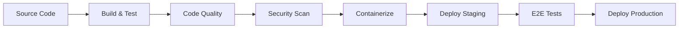

# CI/CD Setup Guide for Job Application Tracker

This document outlines the comprehensive CI/CD pipeline implementation for the Job Application Tracker full-stack application.

## 🎯 Overview

The CI/CD pipeline implements modern DevOps best practices with:

- **Continuous Integration**: Automated testing, code quality checks, and security scanning
- **Continuous Deployment**: Automated containerization and deployment
- **Multi-environment**: Support for staging and production environments
- **Security-first**: Vulnerability scanning and dependency checks
- **Quality Gates**: Code coverage, static analysis, and performance monitoring

## 🏗️ Pipeline Architecture

### Pipeline Stages



### Jobs Overview

1. **backend-build**: Builds and tests the Spring Boot application
2. **backend-code-quality**: Runs SonarQube, OWASP, and static analysis
3. **frontend-build**: Builds and tests the React application
4. **frontend-e2e**: Runs end-to-end tests with Playwright
5. **security-scan**: Vulnerability scanning with Trivy
6. **docker-build**: Builds and pushes Docker images
7. **deploy-staging**: Deploys to staging environment
8. **deploy-production**: Deploys to production environment

## 🔧 Configuration Requirements

### GitHub Repository Secrets

Configure the following secrets in your GitHub repository settings:

#### Required Secrets

```bash
# Docker Hub
DOCKERHUB_USERNAME=your-dockerhub-username
DOCKERHUB_TOKEN=your-dockerhub-access-token

# SonarCloud (Optional but recommended)
SONAR_TOKEN=your-sonarcloud-token

# Code Coverage (Optional)
CODECOV_TOKEN=your-codecov-token

# Notifications (Optional)
SLACK_WEBHOOK_URL=your-slack-webhook-url
```

#### Cloud Provider Secrets (Choose based on your deployment target)

```bash
# AWS
AWS_ACCESS_KEY_ID=your-aws-access-key
AWS_SECRET_ACCESS_KEY=your-aws-secret-key
AWS_REGION=your-aws-region

# Azure
AZURE_CREDENTIALS=your-azure-service-principal
AZURE_SUBSCRIPTION_ID=your-azure-subscription

# Google Cloud
GCP_SA_KEY=your-gcp-service-account-key
GCP_PROJECT_ID=your-gcp-project-id
```

### GitHub Environments

Configure the following environments in your repository:

1. **staging**: For staging deployments
2. **production**: For production deployments (with approval required)

## 🛠️ Local Development Setup

### Prerequisites

- Docker and Docker Compose
- Java 17
- Node.js 20
- Maven 3.6+

### Quick Start

```bash
# Clone the repository
git clone <your-repo-url>
cd Job-Application-Tracker

# Start all services with Docker Compose
docker-compose up -d

# Or run individually:

# Backend
cd backend
./mvnw spring-boot:run

# Frontend
cd frontend
npm install
npm run dev
```

### Running Tests Locally

```bash
# Backend tests
cd backend
./mvnw test

# Frontend tests
cd frontend
npm test

# E2E tests
npm run test:e2e

# Code quality checks
cd backend
./mvnw sonar:sonar -Dsonar.login=$SONAR_TOKEN
```

## 🔒 Security Features

### Implemented Security Measures

1. **Dependency Scanning**: OWASP dependency check for vulnerable dependencies
2. **Container Scanning**: Trivy vulnerability scanner for Docker images
3. **Code Analysis**: SonarQube for code security issues
4. **Static Analysis**: SpotBugs and PMD for bug detection
5. **Security Headers**: Nginx configured with security headers
6. **Non-root Containers**: All containers run as non-root users

### Security Configuration Files

- `backend/owasp-suppressions.xml`: OWASP false positive suppressions
- `frontend/nginx.conf`: Nginx security headers and CSP
- `.github/workflows/ci-cd.yml`: Security scanning configurations

## 📊 Code Quality & Coverage

### Quality Gates

- **Code Coverage**: Minimum 70% coverage required
- **Sonar Quality Gate**: Must pass SonarCloud quality checks
- **Security**: No high-severity vulnerabilities allowed
- **Code Style**: Checkstyle, PMD, and ESLint compliance

### Metrics Tracked

- Line coverage, branch coverage, test execution time
- Code duplication, cyclomatic complexity
- Security hotspots, code smells, bugs
- Performance metrics, bundle sizes

## 🚀 Deployment Strategy

### Branching Strategy

```
main (production)
├── develop (staging)
├── feature/feature-name
└── hotfix/fix-name
```

### Deployment Flow

1. **Feature Development**: Create feature branch from `develop`
2. **Pull Request**: Merge to `develop` triggers staging deployment
3. **Testing**: Manual testing on staging environment
4. **Release**: Merge `develop` to `main` triggers production deployment

### Environment Configuration

#### Staging Environment
- Automatic deployment from `develop` branch
- Uses test data and configurations
- Suitable for integration testing

#### Production Environment
- Manual approval required
- Automatic deployment from `main` branch
- Production-grade configurations
- Monitoring and alerting enabled

## 🐳 Container Strategy

### Multi-stage Builds

Both frontend and backend use optimized multi-stage Docker builds:

- **Build Stage**: Compiles and builds the application
- **Production Stage**: Minimal runtime image with security hardening

### Image Optimization

- Alpine-based images for smaller size
- Non-root user execution
- Health checks included
- Layer caching optimization

### Registry Management

- Semantic versioning with git SHA
- Latest tag for main branch
- Branch-specific tags for development
- Image scanning before push

## 📈 Monitoring & Observability

### Application Health

- Spring Boot Actuator endpoints
- Custom health checks for dependencies
- Readiness and liveness probes

### Metrics Collection

- JVM metrics, HTTP request metrics
- Frontend performance metrics
- Database connection pool metrics
- Custom business metrics

### Alerting

- Failed deployments
- Security vulnerabilities found
- Performance degradation
- High error rates

## 🔄 Rollback Strategy

### Automated Rollback Triggers

- Health check failures
- Error rate spikes
- Performance degradation

### Manual Rollback Process

```bash
# Rollback to previous version
kubectl rollout undo deployment/job-tracker-backend
kubectl rollout undo deployment/job-tracker-frontend

# Or use specific revision
kubectl rollout undo deployment/job-tracker-backend --to-revision=2
```

## 🚨 Troubleshooting

### Common Issues

#### Pipeline Failures

1. **Test Failures**: Check test reports in Actions artifacts
2. **Build Failures**: Verify dependencies and environment variables
3. **Security Failures**: Review vulnerability reports and update dependencies
4. **Deployment Failures**: Check target environment status and credentials

#### Local Development

1. **Port Conflicts**: Ensure ports 3000, 8080, 5432 are available
2. **Docker Issues**: Verify Docker daemon is running
3. **Database Connection**: Check PostgreSQL configuration

### Debug Commands

```bash
# View pipeline logs
gh run view <run-id> --log

# Check container logs
docker logs job-tracker-backend
docker logs job-tracker-frontend

# Test database connection
docker exec -it job-tracker-db psql -U jobtracker -d jobtracker
```

## 📝 Contributing

### Code Quality Standards

1. Write comprehensive tests (unit, integration, E2E)
2. Follow code style guidelines (Checkstyle, ESLint)
3. Document public APIs and complex logic
4. Update tests when modifying functionality

### Pull Request Guidelines

1. Create feature branch from `develop`
2. Ensure all CI checks pass
3. Add/update tests for new functionality
4. Update documentation if needed
5. Request code review

## 🔗 Additional Resources

- [Spring Boot Best Practices](https://spring.io/guides)
- [React Testing Best Practices](https://testing-library.com/docs/)
- [Docker Security Best Practices](https://docs.docker.com/develop/security-best-practices/)
- [GitHub Actions Documentation](https://docs.github.com/en/actions)
- [SonarQube Quality Gates](https://docs.sonarqube.org/latest/user-guide/quality-gates/)

---

## 📋 Checklist for New Team Members

- [ ] Clone repository and run locally
- [ ] Set up IDE with code formatting rules
- [ ] Configure Git hooks for commit validation
- [ ] Access to required services (SonarCloud, Docker Hub, etc.)
- [ ] Understanding of branching and deployment strategy
- [ ] Review code quality and security guidelines

This CI/CD setup ensures high-quality, secure, and reliable software delivery for the Job Application Tracker application. 