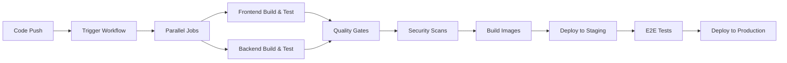

# CI/CD Pipeline Documentation

This document provides comprehensive information about the CI/CD pipeline for the Job Application Tracker project, including workflows, quality gates, security scanning, and deployment strategies.

## 🏗️ Pipeline Overview

Our CI/CD pipeline is built with GitHub Actions and follows modern DevOps practices:



## 📋 Workflow Structure

### Main Workflow: `.github/workflows/ci-cd.yml`

The pipeline consists of several parallel and sequential jobs:

1. **Code Quality & Testing**
   - Frontend linting and testing
   - Backend testing and coverage
   - Static code analysis

2. **Security Scanning**
   - Dependency vulnerability scanning
   - Container image scanning
   - SAST (Static Application Security Testing)

3. **Build & Package**
   - Docker image building
   - Multi-stage optimized builds
   - Image tagging and registry push

4. **Deployment**
   - Staging environment deployment
   - Production deployment (on main branch)
   - Health checks and verification

## 🎯 Trigger Events

The pipeline triggers on:

```yaml
on:
  push:
    branches: [ main, develop ]
  pull_request:
    branches: [ main ]
  workflow_dispatch:  # Manual trigger
  schedule:
    - cron: '0 2 * * 1'  # Weekly security scans
```

### Branch Strategy

- **`main`**: Production deployments
- **`develop`**: Staging deployments  
- **Feature branches**: Testing and quality checks only
- **Pull requests**: Full pipeline without deployment

## 🧪 Testing Strategy

### Frontend Testing Jobs

```yaml
frontend-test:
  runs-on: ubuntu-latest
  steps:
    - uses: actions/checkout@v4
    
    - name: Setup Node.js
      uses: actions/setup-node@v4
      with:
        node-version: '20'
        cache: 'npm'
        cache-dependency-path: frontend/package-lock.json
    
    - name: Install dependencies
      run: npm ci
      working-directory: frontend
    
    - name: Run linting
      run: npm run lint
      working-directory: frontend
    
    - name: Run unit tests
      run: npm run test:coverage
      working-directory: frontend
    
    - name: Upload coverage
      uses: codecov/codecov-action@v3
      with:
        file: frontend/coverage/lcov.info
        flags: frontend
```

### Backend Testing Jobs

```yaml
backend-test:
  runs-on: ubuntu-latest
  services:
    postgres:
      image: postgres:15
      env:
        POSTGRES_PASSWORD: postgres
        POSTGRES_DB: jobtracker_test
      options: >-
        --health-cmd pg_isready
        --health-interval 10s
        --health-timeout 5s
        --health-retries 5
  
  steps:
    - uses: actions/checkout@v4
    
    - name: Set up JDK 17
      uses: actions/setup-java@v4
      with:
        java-version: '17'
        distribution: 'temurin'
    
    - name: Cache Maven packages
      uses: actions/cache@v3
      with:
        path: ~/.m2
        key: ${{ runner.os }}-m2-${{ hashFiles('**/pom.xml') }}
    
    - name: Run tests
      run: ./mvnw test
      working-directory: backend
      env:
        DB_HOST: localhost
        DB_PORT: 5432
        DB_NAME: jobtracker_test
        DB_USER: postgres
        DB_PASSWORD: postgres
    
    - name: Generate coverage report
      run: ./mvnw jacoco:report
      working-directory: backend
    
    - name: Upload coverage
      uses: codecov/codecov-action@v3
      with:
        file: backend/target/site/jacoco/jacoco.xml
        flags: backend
```

## 🔒 Security Scanning

### OWASP Dependency Check

```yaml
security-scan:
  runs-on: ubuntu-latest
  steps:
    - uses: actions/checkout@v4
    
    - name: Run OWASP Dependency Check
      uses: dependency-check/Dependency-Check_Action@main
      with:
        project: 'Job-Application-Tracker'
        path: '.'
        format: 'ALL'
        args: >
          --enableRetired
          --enableExperimental
          --suppression owasp-suppressions.xml
    
    - name: Upload OWASP report
      uses: actions/upload-artifact@v3
      with:
        name: dependency-check-report
        path: reports/
```

### Container Security Scanning

```yaml
container-scan:
  runs-on: ubuntu-latest
  needs: [build-images]
  steps:
    - name: Run Trivy vulnerability scanner
      uses: aquasecurity/trivy-action@master
      with:
        image-ref: 'jleyva816/jobtracker-backend:${{ github.sha }}'
        format: 'sarif'
        output: 'trivy-results.sarif'
    
    - name: Upload Trivy scan results
      uses: github/codeql-action/upload-sarif@v2
      with:
        sarif_file: 'trivy-results.sarif'
```

### SonarQube Analysis

```yaml
sonarqube:
  runs-on: ubuntu-latest
  steps:
    - uses: actions/checkout@v4
      with:
        fetch-depth: 0
    
    - name: SonarQube Scan
      uses: sonarqube-quality-gate-action@master
      env:
        GITHUB_TOKEN: ${{ secrets.GITHUB_TOKEN }}
        SONAR_TOKEN: ${{ secrets.SONAR_TOKEN }}
      with:
        projectBaseDir: .
        args: >
          -Dsonar.projectKey=jnleyva816_Job-Application-Tracker
          -Dsonar.organization=jnleyva816
          -Dsonar.host.url=https://sonarcloud.io
```

## 🐳 Container Building

### Multi-Stage Docker Builds

Both frontend and backend use optimized multi-stage builds:

```yaml
build-images:
  runs-on: ubuntu-latest
  needs: [frontend-test, backend-test, security-scan]
  outputs:
    backend-image: ${{ steps.meta-backend.outputs.tags }}
    frontend-image: ${{ steps.meta-frontend.outputs.tags }}
  
  steps:
    - uses: actions/checkout@v4
    
    - name: Set up Docker Buildx
      uses: docker/setup-buildx-action@v3
    
    - name: Login to Docker Hub
      uses: docker/login-action@v3
      with:
        username: ${{ secrets.DOCKER_USERNAME }}
        password: ${{ secrets.DOCKER_PASSWORD }}
    
    - name: Extract metadata (backend)
      id: meta-backend
      uses: docker/metadata-action@v5
      with:
        images: jleyva816/jobtracker-backend
        tags: |
          type=ref,event=branch
          type=ref,event=pr
          type=sha,prefix={{branch}}-
          type=raw,value=latest,enable={{is_default_branch}}
    
    - name: Build and push backend
      uses: docker/build-push-action@v5
      with:
        context: ./backend
        platforms: linux/amd64,linux/arm64
        push: true
        tags: ${{ steps.meta-backend.outputs.tags }}
        labels: ${{ steps.meta-backend.outputs.labels }}
        cache-from: type=gha
        cache-to: type=gha,mode=max
    
    - name: Extract metadata (frontend)
      id: meta-frontend
      uses: docker/metadata-action@v5
      with:
        images: jleyva816/jobtracker-frontend
    
    - name: Build and push frontend
      uses: docker/build-push-action@v5
      with:
        context: ./frontend
        platforms: linux/amd64,linux/arm64
        push: true
        tags: ${{ steps.meta-frontend.outputs.tags }}
        labels: ${{ steps.meta-frontend.outputs.labels }}
```

## 🚀 Deployment Strategy

### Staging Deployment

```yaml
deploy-staging:
  runs-on: ubuntu-latest
  needs: [build-images]
  if: github.ref == 'refs/heads/develop'
  environment: staging
  
  steps:
    - name: Deploy to staging
      run: |
        # Update staging environment with new images
        echo "Deploying to staging..."
        # Implementation depends on infrastructure setup
    
    - name: Run health checks
      run: |
        # Verify deployment health
        curl -f https://staging-api.yourdomain.com/actuator/health
        curl -f https://staging.yourdomain.com
    
    - name: Run E2E tests
      run: |
        # Run end-to-end tests against staging
        npm run test:e2e:staging
```

### Production Deployment

```yaml
deploy-production:
  runs-on: ubuntu-latest
  needs: [build-images, deploy-staging]
  if: github.ref == 'refs/heads/main'
  environment: 
    name: production
    url: https://yourdomain.com
  
  steps:
    - name: Deploy to production
      run: |
        # Blue-green deployment strategy
        echo "Deploying to production..."
    
    - name: Health check
      run: |
        # Verify production deployment
        curl -f https://api.yourdomain.com/actuator/health
    
    - name: Notify deployment
      uses: 8398a7/action-slack@v3
      with:
        status: ${{ job.status }}
        channel: '#deployments'
        webhook_url: ${{ secrets.SLACK_WEBHOOK }}
```

## 📊 Quality Gates

### Coverage Requirements

- **Backend**: Minimum 70% code coverage
- **Frontend**: Minimum 80% code coverage
- **End-to-End**: Critical user paths covered

### Security Gates

- **No high or critical vulnerabilities** in dependencies
- **Container images** must pass security scanning
- **SonarQube quality gate** must pass

### Performance Gates

- **Build time**: Maximum 15 minutes total
- **Test execution**: Maximum 10 minutes per test suite
- **Image size**: Optimized for production use

## 🔧 Configuration

### Required Secrets

Configure these secrets in your GitHub repository:

```yaml
# Docker Hub credentials
DOCKER_USERNAME: jleyva816
DOCKER_PASSWORD: <docker-hub-token>

# SonarQube configuration
SONAR_TOKEN: <sonarqube-token>

# Slack notifications
SLACK_WEBHOOK: <slack-webhook-url>

# Deployment credentials
STAGING_DEPLOY_KEY: <staging-ssh-key>
PROD_DEPLOY_KEY: <production-ssh-key>

# Database credentials (for testing)
DB_PASSWORD: <test-db-password>
```

### Environment Variables

```yaml
# Application configuration
API_URL: https://api.yourdomain.com
APP_NAME: Job Application Tracker
NODE_ENV: production

# Feature flags
ENABLE_ANALYTICS: true
ENABLE_MONITORING: true
```

## 📈 Monitoring & Observability

### Pipeline Metrics

- **Build success rate**: Target >95%
- **Average build time**: Monitor trends
- **Test coverage**: Track coverage over time
- **Security issues**: Zero tolerance for high/critical

### Notifications

```yaml
- name: Notify on failure
  if: failure()
  uses: 8398a7/action-slack@v3
  with:
    status: failure
    text: 'CI/CD Pipeline failed! Check logs for details.'
    webhook_url: ${{ secrets.SLACK_WEBHOOK }}

- name: Notify on success
  if: success() && github.ref == 'refs/heads/main'
  uses: 8398a7/action-slack@v3
  with:
    status: success
    text: 'Production deployment successful! 🎉'
    webhook_url: ${{ secrets.SLACK_WEBHOOK }}
```

## 🐛 Troubleshooting

### Common Issues

**Build timeouts:**
```yaml
# Increase timeout for resource-intensive jobs
timeout-minutes: 30
```

**Cache misses:**
```yaml
# Ensure proper cache key strategies
cache-dependency-path: '**/package-lock.json'
```

**Flaky tests:**
```yaml
# Retry failed tests
- name: Run tests with retry
  uses: nick-invision/retry@v2
  with:
    timeout_minutes: 10
    max_attempts: 3
    command: npm test
```

### Debugging Workflows

```yaml
# Enable debug logging
- name: Debug workflow
  run: |
    echo "Runner OS: ${{ runner.os }}"
    echo "GitHub ref: ${{ github.ref }}"
    echo "Event name: ${{ github.event_name }}"
  env:
    ACTIONS_STEP_DEBUG: true
```

## 📋 Best Practices

### Workflow Optimization

1. **Parallel execution**: Run independent jobs concurrently
2. **Caching strategies**: Cache dependencies and build artifacts
3. **Conditional execution**: Skip unnecessary steps based on changes
4. **Resource limits**: Set appropriate timeouts and resource constraints

### Security Best Practices

1. **Secrets management**: Use GitHub secrets for sensitive data
2. **Least privilege**: Grant minimal required permissions
3. **Dependency scanning**: Regular vulnerability assessments
4. **Container hardening**: Use minimal base images and non-root users

### Monitoring and Alerting

1. **Real-time notifications**: Slack/email alerts for failures
2. **Trend analysis**: Monitor build times and success rates
3. **Quality metrics**: Track code coverage and security issues
4. **Performance monitoring**: Application performance post-deployment

---

*This CI/CD pipeline documentation is maintained by the development team and updated with new features and improvements.* 